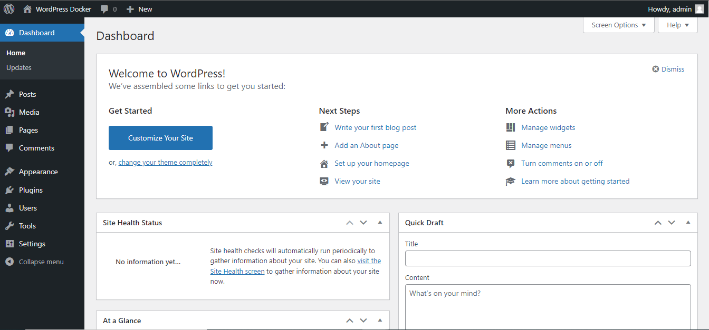
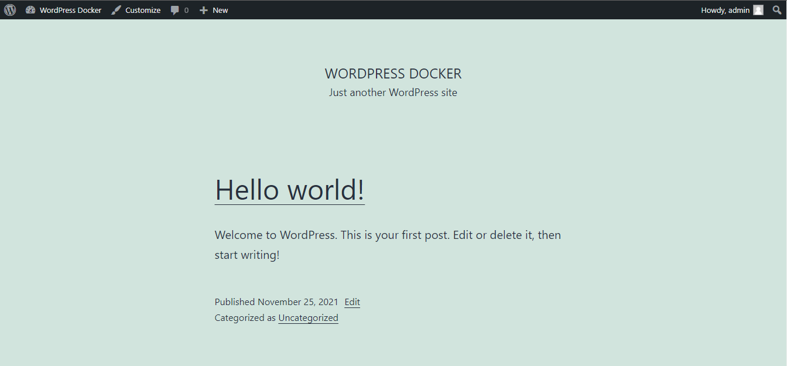

Usage
=====
If you want custom your database you must edit this :

```docker
- MYSQL_DATABASE=wordpress
........
- WORDPRESS_DB_NAME=wordpress
........
```
If done, you can build 
```console
docker compose up -d
```

Stop the container
```console
docker compose down
```

Output
======







